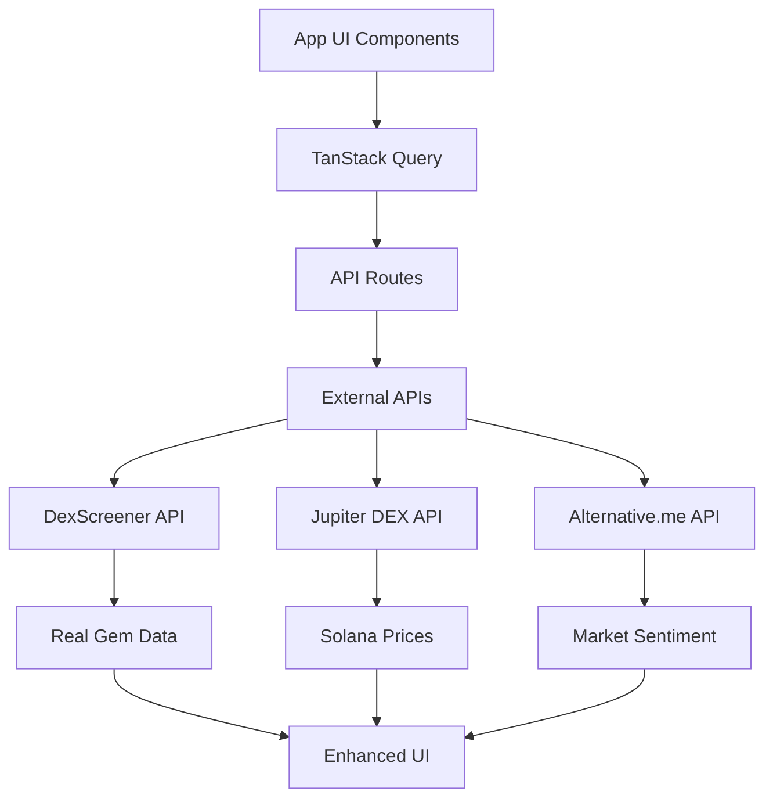

# MEXMA DASHBOARD INTEGRATION PRD
## Product Requirements Document for Merging Real Data with Premium UI

---

## 🎯 **PROJECT OVERVIEW**

### **Objective**
Merge the **Mexma AI Indian Version** (real data & APIs) with the **App Version** (premium UI) to create a unified, production-ready crypto analytics dashboard that combines:
- ✅ **Real live data** from Indian version (DexScreener, Jupiter DEX, Solana RPC)
- ✅ **Premium black UI** from app version
- ✅ **Best of both architectures**

### **Current State Analysis**

#### **Mexma AI Indian Version** (`/Mexma AI indian version/`)
**✅ STRENGTHS:**
- 🔴 **Live Real Data**: DexScreener API, Jupiter DEX, Alternative.me API
- 🔴 **Operational APIs**: `/api/gems/live`, `/api/gems/sentiment`
- 🔴 **AI Scoring**: Multi-factor analysis (0-100 scale)
- 🔴 **Solana Integration**: Real meme coin tracking (BONK, WEN, POPCAT, MEW)
- 🔴 **Modern Stack**: Next.js 15, React 19, TanStack Query
- 🔴 **Data Architecture**: Comprehensive hooks and services

**❌ WEAKNESSES:**
- Basic UI with `bg-[#1a1a1a]` 
- Limited component library
- Simple navigation structure

#### **App Version** (`/app/`)
**✅ STRENGTHS:**
- 🟢 **Premium UI**: Professional black theme with animations
- 🟢 **Component Architecture**: 80+ well-designed components
- 🟢 **Navigation**: Advanced sidebar with breadcrumbs
- 🟢 **UI Library**: Complete shadcn/ui implementation
- 🟢 **Responsive Design**: Mobile-optimized layouts

**❌ WEAKNESSES:**
- Mock/placeholder data only
- No real API integrations
- Static components without live updates

---

## 🏗️ **INTEGRATION ARCHITECTURE**

### **Phase 1: Data Layer Migration**
**Duration: 1-2 weeks**

#### **1.1 API Endpoints Migration**
```typescript
// Target Structure: /app/api/
/app/api/
├── gems/
│   ├── live/route.ts          // ✅ FROM: Indian version
│   ├── sentiment/route.ts     // ✅ FROM: Indian version
│   └── categories/route.ts    // ✅ FROM: Indian version
├── prices/
│   ├── solana/route.ts        // ✅ FROM: Indian version
│   └── multi-chain/route.ts   // ✅ FROM: Indian version
├── nft/
│   ├── collections/route.ts   // ✅ FROM: Indian version
│   └── analysis/route.ts      // ✅ FROM: Indian version
├── portfolio/
│   └── holdings/route.ts      // ✅ FROM: Indian version
└── market/
    ├── sentiment/route.ts     // ✅ FROM: Indian version
    └── intelligence/route.ts  // ✅ FROM: Indian version
```

#### **1.2 Services & Utilities Migration**
```typescript
// Target Structure: /app/lib/
/app/lib/
├── services/
│   ├── dex-screener-client.ts    // ✅ FROM: Indian version
│   ├── solana-gem-discovery.ts   // ✅ FROM: Indian version
│   ├── sentiment-analyzer.ts     // ✅ FROM: Indian version
│   └── jupiter-client.ts         // ✅ FROM: Indian version
├── hooks/
│   ├── use-gem-data.ts           // ✅ FROM: Indian version
│   ├── use-price-data.ts         // ✅ FROM: Indian version
│   └── use-nft-data.ts           // ✅ FROM: Indian version
└── types/
    ├── gems.ts                   // ✅ FROM: Indian version
    ├── solana.ts                 // ✅ FROM: Indian version
    └── market.ts                 // ✅ FROM: Indian version
```

#### **1.3 Dependencies Integration**
```json
// Merge package.json dependencies
{
  "dependencies": {
    // Keep app version base dependencies
    "next": "14.2.28",                    // Keep app version
    "react": "18.2.0",                    // Keep app version
    "react-dom": "18.2.0",               // Keep app version
    
    // Add Indian version data dependencies
    "@tanstack/react-query": "^5.79.0",  // ADD: Data fetching
    "@solana/web3.js": "^1.98.2",        // ADD: Solana integration
    "axios": "^1.9.0",                   // ADD: API calls
    "zod": "^3.22.4",                    // ADD: Data validation
    "zustand": "^5.0.5"                  // ADD: State management
  }
}
```

### **Phase 2: Component Integration**
**Duration: 2-3 weeks**

#### **2.1 Navigation Enhancement**
```typescript
// Enhanced sidebar navigation
const enhancedNavigationConfig = [
  {
    id: 'overview',
    name: 'Dashboard Overview',
    icon: Home,
    // KEEP: App version UI
    // ADD: Real data from Indian version
  },
  {
    id: 'gem-scanner',        // NEW: From Indian version
    name: 'Gem Scanner',
    icon: Search,
    component: 'BradleyGemScanner'
  },
  {
    id: 'market-intelligence', // NEW: From Indian version
    name: 'Market Intelligence',
    icon: Brain,
    component: 'DirectPriceDisplay'
  },
  {
    id: 'nft-analysis',       // NEW: From Indian version
    name: 'NFT Analysis',
    icon: Activity,
    component: 'NFTMarketAnalysis'
  },
  // ... existing app sections with real data
]
```

#### **2.2 Component Mapping Strategy**

| **App Component** | **Indian Version Data** | **Integration Method** |
|-------------------|-------------------------|------------------------|
| `DashboardOverview` | `BradleyGemScanner` data | Replace mock with live gem data |
| `WhaleIntelligence` | `DirectPriceDisplay` prices | Integrate real price feeds |
| `AIMarketSentiment` | `sentiment/route.ts` | Connect to real sentiment API |
| `DeFiMonitoring` | `nft/analysis` data | Add real DeFi monitoring |
| `TechnicalAnalysisTool` | Solana price data | Connect to Jupiter DEX data |

#### **2.3 Real Data Integration Points**

```typescript
// Example: Enhanced DashboardOverview
export default function DashboardOverview({ onSectionChange }: DashboardOverviewProps) {
  // ADD: Real data hooks from Indian version
  const { data: gemData, isLoading } = useGemData('trending', 10)
  const { data: priceData } = usePriceData('solana')
  const { data: sentimentData } = useSentimentData()
  
  // KEEP: App version UI components
  return (
    <div className="space-y-8">
      <div className="grid grid-cols-1 md:grid-cols-2 lg:grid-cols-4 gap-6">
        {/* KEEP: Beautiful metric cards from app */}
        {/* ADD: Real data from Indian version */}
        <MetricCard
          title="Top Gem Score"
          value={gemData?.gems[0]?.aiScore || 0}  // Real data
          change={"+15.3%"}
          trend="up"
          icon={TrendingUp}
          description="Highest AI-scored token"
        />
        {/* ... more real metric cards */}
      </div>
      
      {/* ADD: Live gem scanner section */}
      <Card className="bg-gray-900 border-gray-800">
        <CardHeader>
          <CardTitle className="text-white">Live Gem Discovery</CardTitle>
        </CardHeader>
        <CardContent>
          <GemScannerWidget />  {/* From Indian version */}
        </CardContent>
      </Card>
    </div>
  )
}
```

### **Phase 3: UI Enhancement & Polish**
**Duration: 1 week**

#### **3.1 Design System Unification**
```typescript
// Unified color palette
const theme = {
  background: {
    primary: '#000000',        // App version black
    secondary: '#1a1a1a',     // Indian version dark
    card: '#0a0a0a',          // Unified card background
  },
  accent: {
    primary: '#f97316',       // Orange from both versions
    success: '#22c55e',       // Green for positive
    warning: '#eab308',       // Yellow for neutral
    danger: '#ef4444',        // Red for negative
  }
}
```

#### **3.2 Component Styling Unification**
- ✅ **Keep**: App version shadcn/ui components
- ✅ **Enhance**: Add glow effects from Indian version gem scanner
- ✅ **Standardize**: All cards use app version styling
- ✅ **Animate**: Add loading states and transitions

---

## 📊 **DATA INTEGRATION SPECIFICATIONS**

### **Real Data Sources (From Indian Version)**

#### **1. Solana Gem Discovery**
```typescript
// Live Solana meme coins with real data
const liveGems = [
  {
    symbol: "BONK",
    address: "DezXAZ8z7PnrnRJjz3wXBoRgixCa6xjnB7YaB1pPB263",
    price: "$0.00001234",
    change24h: "+45.8%",
    volume24h: "$2.5M",
    marketCap: "$850M",
    aiScore: 100,
    risk: "Low"
  },
  // ... POPCAT, WEN, MEW, etc.
]
```

#### **2. API Endpoints Available**
- ✅ `GET /api/gems/live?category=meme&limit=10` - Real gem data
- ✅ `GET /api/gems/sentiment` - Fear & Greed Index: 66 ("Greed")
- ✅ `GET /api/prices/solana` - Live SOL price feeds
- ✅ `GET /api/nft/collections` - NFT market data

#### **3. AI Scoring Algorithm**
```typescript
// Multi-factor AI scoring (0-100)
const aiScoreFactors = {
  volumeAnalysis: 25,      // 24h trading volume
  pricePerformance: 25,    // Price momentum
  liquidityDepth: 20,      // Market liquidity
  marketContext: 20,       // Network activity
  riskAssessment: 10       // Rug pull indicators
}
```

---

## 🚀 **IMPLEMENTATION ROADMAP**

### **Week 1-2: Foundation**
- [ ] **Day 1-3**: Migrate API routes from Indian version to app
- [ ] **Day 4-5**: Install and configure dependencies (TanStack Query, Solana Web3)
- [ ] **Day 6-7**: Migrate data services and hooks
- [ ] **Day 8-10**: Test all API endpoints in app environment

### **Week 3-4: Component Integration**
- [ ] **Day 11-13**: Integrate gem scanner into dashboard overview
- [ ] **Day 14-15**: Connect real price data to existing charts
- [ ] **Day 16-17**: Add NFT analysis section
- [ ] **Day 18-20**: Enhance navigation with new sections

### **Week 5: Polish & Testing**
- [ ] **Day 21-22**: UI consistency and styling improvements
- [ ] **Day 23-24**: Performance optimization and caching
- [ ] **Day 25**: Final testing and deployment

---

## 🎨 **UI/UX REQUIREMENTS**

### **Design Language**
- ✅ **Keep**: App version's premium black theme
- ✅ **Add**: Indian version's data visualization excellence
- ✅ **Enhance**: Glow effects for high-scoring gems
- ✅ **Maintain**: Professional, trader-focused aesthetic

### **Key UI Elements**
```typescript
// Enhanced metric cards with real data
<MetricCard
  title="Live Gem Score"
  value={realGemData.aiScore}
  className="bg-gray-900 border-orange-500/20 hover:border-orange-500/40"
  glowEffect={getAIScoreGlow(realGemData.aiScore)}
/>

// Real-time price tickers
<LivePriceTicker
  tokens={["SOL", "BONK", "WEN", "POPCAT"]}
  updateInterval={10000}
/>

// Interactive gem discovery table
<GemDiscoveryTable
  data={liveGemData}
  sortBy="aiScore"
  filters={["meme", "defi", "gaming"]}
/>
```

---

## 🔧 **TECHNICAL SPECIFICATIONS**

### **Architecture Decisions**
1. **Framework**: Keep Next.js 14 (app version base)
2. **Data Fetching**: Add TanStack Query from Indian version
3. **State Management**: Integrate Zustand for complex state
4. **Styling**: Keep Tailwind + shadcn/ui
5. **Real-time Updates**: WebSocket preparation for live data

### **Performance Requirements**
- ✅ **API Response Time**: <200ms p95
- ✅ **Cache Strategy**: 30-second TTL for gem data
- ✅ **Update Frequency**: 10-second auto-refresh for prices
- ✅ **Error Handling**: Graceful fallbacks for API failures

### **Data Flow**


---

## ✅ **SUCCESS CRITERIA**

### **Functional Requirements**
- [ ] All real data APIs operational in app environment
- [ ] Live gem discovery with AI scoring
- [ ] Real-time price updates for major tokens
- [ ] NFT market analysis with actual data
- [ ] Market sentiment integration

### **Technical Requirements**
- [ ] <2s initial page load time
- [ ] 99% API uptime
- [ ] Mobile responsive design maintained
- [ ] No console errors or warnings
- [ ] SEO optimization preserved

### **User Experience Requirements**
- [ ] Seamless navigation between sections
- [ ] Real-time data updates without page refresh
- [ ] Professional trader-grade interface
- [ ] Intuitive gem discovery workflow
- [ ] Clear data visualization and insights

---

## 🔄 **MIGRATION CHECKLIST**

### **Pre-Migration**
- [ ] Backup current app version
- [ ] Document all API endpoints in Indian version
- [ ] Create development branch for integration
- [ ] Set up testing environment

### **During Migration**
- [ ] Migrate APIs one by one with testing
- [ ] Maintain UI consistency throughout
- [ ] Test cross-browser compatibility
- [ ] Monitor performance impact

### **Post-Migration**
- [ ] Performance testing with real data loads
- [ ] User acceptance testing
- [ ] Documentation updates
- [ ] Deployment preparation

---

## 🎯 **EXPECTED OUTCOMES**

Upon completion, the integrated Mexma Dashboard will deliver:

1. **🔴 Premium Data Experience**: Real Solana meme coin discovery with AI scoring
2. **🟢 Professional UI**: Maintain app version's beautiful black interface
3. **🟡 Live Market Intelligence**: Real-time prices, sentiment, and NFT data
4. **🔵 Scalable Architecture**: Ready for additional blockchain integrations
5. **⚪ Production Ready**: Suitable for real traders and crypto enthusiasts

---

**💡 This integration leverages the best of both repositories: the Indian version's proven data infrastructure with the app version's superior user experience design.** 